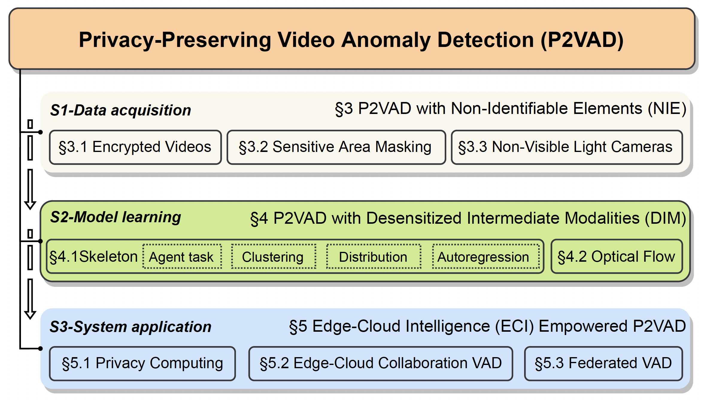
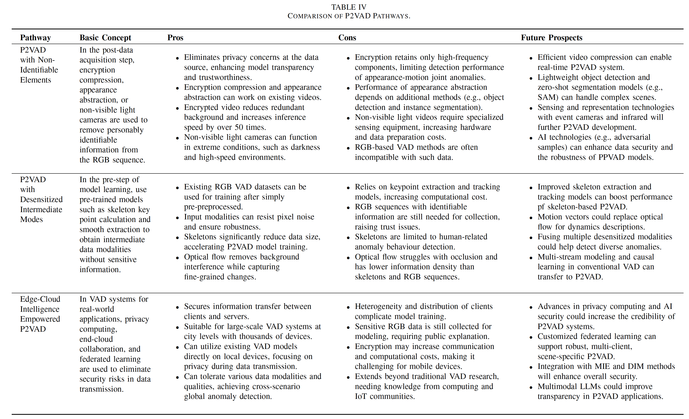

# Privacy-Preserving Video Anomaly Detection: A Survey

This is the official repository for the paper titled **"Privacy-Preserving Video Anomaly Detection: A Survey"**, submitted to 📰 [IEEE Transactions on Circuits and Systems for Video Technology](https://ieee-cas.org/publication/tcsvt).  Video Anomaly Detection (VAD) aims to automatically analyze spatiotemporal patterns in surveillance videos collected from open spaces to detect anomalous events that may cause harm without physical contact. VAD has broad applications in smart cities and public services. However, vision-based surveillance systems such as closed-circuit television often capture personally identifiable information and sensitive environmental data. The lack of transparency and interpretability in data transmission and usage raises public concerns about privacy and ethics, limiting the real-world adoption of VAD technology. Recently, researchers have started addressing privacy concerns in VAD by conducting systematic studies from perspectives including data, features, and systems, which not only enhance public trust but also demonstrate performance advantages in various scenarios such as crowded spaces, making *Privacy-Preserving Video Anomaly Detection (P2VAD)* a hotspot in the AI community. However, current research in P2VAD is fragmented, and prior reviews have mostly focused on methods using RGB sequences, overlooking privacy leakage and appearance bias considerations. To address this gap, this article systematically reviews the progress of P2VAD for the first time, defining its scope and providing an intuitive taxonomy. In this repository, we provide open access to P2VAD-related research resources.

% ## Table of contents

% [TOC]

## 📷 Datasets

### 🔓 Generailized VAD Datasets

| Dataset                                                      | #Videos | #Normal | #Abnormal | #Scenes | #Anomalies | #Classes |
| :----------------------------------------------------------- | :-----: | :-----: | :-------: | :-----: | :--------: | -------- |
| [UMN](http://mha.cs.umn.edu/proj_events.shtml#crowd)         |         |  6,165  |   1,576   |    3    |     11     | 3        |
| [Subway Entrance](https://vision.eecs.yorku.ca/research/anomalous-behaviour-data/sets/) |         | 132,138 |  12,112   |    1    |     51     | 5        |
| [Subway Exit](https://vision.eecs.yorku.ca/research/anomalous-behaviour-data/sets/) |         | 60,410  |   4,491   |    1    |     14     | 3        |
| [Street Scene](https://www.merl.com/demos/video-anomaly-detection)$^{*}$ |   81    | 159,341 |  43,916   |   205   |     17     | 17       |
| [CUHK Avenue](http://www.cse.cuhk.edu.hk/leojia/projects/detectabnormal/dataset.html) |   37    | 26,832  |   3,820   |    1    |     77     | 5        |
| [ShanghaiTech](https://svip-lab.github.io/dataset/campus_dataset.html) |   437   | 300,308 |  17,090   |   13    |    158     | 11       |
| [UCSD Ped1](http://www.svcl.ucsd.edu/projects/anomaly/dataset.htm) |   70    |  9,995  |   4,005   |    1    |     61     | 5        |
| [UCSD Ped2](http://www.svcl.ucsd.edu/projects/anomaly/dataset.htm) |   29    |  2,924  |   1,636   |    1    |     21     | 5        |
| [UCF-Crime](https://webpages.charlotte.edu/cchen62/dataset.html) |  1,900  |         |           |         |    950     | 13       |
| [ShanghaiTech Weakly](https://github.com/jx-zhong-for-academic-purpose/GCN-Anomaly-Detection/tree/master/ShanghaiTech_new_split)$^{**}$ |   437   |         |           |         |            | 11       |
| [XD-Violance](https://roc-ng.github.io/XD-Violence/)         |  4,754  |         |           |         |            | 6        |
| [ADOC](http://qil.uh.edu/main/datasets/)                     |         |         |  97,030   |    1    |    721     |          |
| [NWPU Campus](https://campusvad.github.io/)                  |   547   |   305   |    242    |   43    |            | 28       |

$^{*}$ *Following previous works, we set the frame rate to 15 fps.*

$^{**}$ *This dataset is reorganized from [ShanghaiTech](https://svip-lab.github.io/dataset/campus_dataset.html), so we provide the reorganized file list here.*

### 🔐 P2VAD-specialized Datasets

- [HR-ShanghaiTech](https://openaccess.thecvf.com/content_CVPR_2019/html/Morais_Learning_Regularity_in_Skeleton_Trajectories_for_Anomaly_Detection_in_Videos_CVPR_2019_paper.html)
- [HR-Avenue](https://openaccess.thecvf.com/content_CVPR_2019/html/Morais_Learning_Regularity_in_Skeleton_Trajectories_for_Anomaly_Detection_in_Videos_CVPR_2019_paper.html)
- [HR-Crime](https://doi.org/10.34894/IRRDJE)
- [Anonymized UCF-Crime](https://joefioresi718.github.io/TeD-SPAD_webpage/)
- [Anonymized XD-Violence](https://joefioresi718.github.io/TeD-SPAD_webpage/)
- [Ubnormal](https://github.com/lilygeorgescu/UBnormal) 
- [PHEVA](https://github.com/tecsar-uncc/pheva)  

## 📁 Taxonomy

### 📌 Taxonomy System

### 📊 Comparison and Dicussion

## 💬 Workshops & Tutorials

- Workshop on conventional AD: 📰 [AI4AN@IJCAI20](https://sites.google.com/view/ai4an2020
  ), 📰 [AI4AN@IJCAI21](https://sites.google.com/view/ai4an2021), 📰 [ANDEA@KDD21](https://sites.google.com/view/andea2021
  )
- Workshop on visual AD: 📰 [AnoDDPM@CVPR22](http://dro.dur.ac.uk/36134/1/36134.pdf
  ), 📰 [BRAVO@ICCV23](https://valeoai.github.io/bravo/
  ), 📰 [ASTAD@WACV24](https://ismart.ece.mcgill.ca/wacv24/
  )
- Tutorial on deep VAD: 📰 [Recent Advances in Anomaly Detection](https://sites.google.com/view/cvpr2023-tutorial-on-ad/)
- Workshop on FL: 📰 [FL@FM-NeurIPS’23](https://federated-learning.org/fl@fm-neurips-2023/), [FedKDD@KDD24](https://fedkdd.github.io/)
- Workshop on ECI: [NIST Workshop on Privacy-Enhancing Cryptography 2024](https://csrc.nist.gov/Events/2024/wpec2024) 

## 🔍 Related Topics & Tasks

- [Deep VAD](https://dl.acm.org/doi/abs/10.1145/3645101)
- Privacy-Preserving
- Encrypted Video Encoding
- Edge-Cloud Intelligence
- [Federated Learning](https://ieeexplore.ieee.org/document/10571602)

## 🛠️ Tools

- `anomalib`: An anomaly detection library comprising state-of-the-art algorithms and features such as experiment management, hyper-parameter optimization, and edge inference. 🌐 [Project Page](https://github.com/openvinotoolkit/anomalib).
- `PyAnomaly`: A PyTorch toolbox for video anomaly detection. 📄 [Paper](https://dl.acm.org/doi/10.1145/3394171.3414540), 🌐 [Project Page](https://github.com/YuhaoCheng/PyAnomaly).

